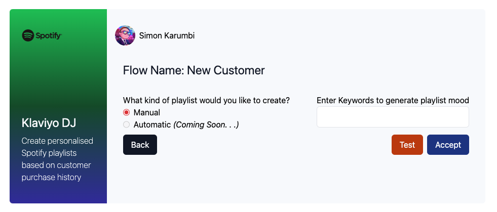
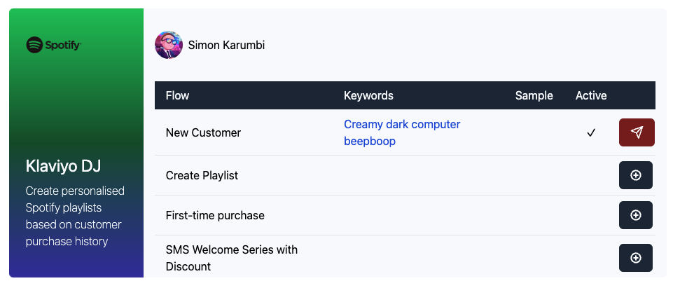

# Klaviyo DJ

This project is aimed at integrating GPT, Spotify and Klaviyo into one application, where you can curate custom playlists for your customers based on Klaviyo Flows triggered by your most important metrics.


## Prerequisites

You will need to create accounts for several platforms.

1. [OpenAI](https://platform.openai.com/): GPT is used to generate moods from your customers favourite items or keywords you specify in order to generate playlists, that are then converted into real Spotify playlists!
2. [Spotify](https://developer.spotify.com/documentation/web-api): The Web API is used to search the tracks that GPT recommends. If GPT hallucinates, no worries! We will just skip that track.
3. [Klaviyo](https://developers.klaviyo.com/en/reference/api_overview): Then in order to distribute these playlists to your special customers, you will need to activate your Klaviyo APIs through the developer portal

## Setup

1. In order to test that everything is working, I suggest using a tool such as `ngrok` to tunnel webhook requests from Klaviyo to your local web server before deploying out into the real world.
2. Set up an `.env` file to store environmental variables for each of the platforms. So you don't accidentally share your Britney Spears playlists, it's also recommended to put your Spotify username here too
3. Create a Klaviyo Flow that takes a "Playlist Created" metric as a trigger. This will be used to send off emails. In the event payload, you can attach properties to the payload attribute and then use the event metadata to populate the customised emails.

    ``` python
    "revision": "2023-12-15",
    event_json = {
            "data": {
                "type": "event",
                "attributes": {
                    "properties": {
                        "title": title,
                        "url": url,
                        "description": description,
                    },
                    "metric": {
                        "data": {
                            "type": "metric",
                            "attributes": {"name": "Playlist Created"},
                        }
                    },
                    "profile": {
                        "data": {
                            "type": "profile",
                            "attributes": {"email": email},
                        }
                    },
                },
            }
        }
    ```

4. Attach a webhook to a Flow that identifies some of your most valued customers, and point it to your production server. __NOTE:__ I haven't figured out a way to relay responses through `ngrok` back to Klaviyo, so Klaviyo will keep on firing webhooks as it doesn't think you are receiving them. This shouldn't happen when using Postman or a production server.

## Installation

This is a web server built using [Litestar](https://litestar.dev/) a fast, performant framework for building API servers, using [Jinja](https://jinja.palletsprojects.com/en/3.0.x/templates/) for templating, [TailwindCSS](https://tailwindcss.com/) and [HTMX](https://htmx.org/) for the front-end. Tailwind and Litestar are already contained, you will need to install Python packages from the provided `./requirements.txt` file.

1. Install Python requirements using `pip install -r requirements.txt` or something similar.
2. Spotify has a strange authentication flow. In order to make this run smoothly during operation run the server initially where you will be redirected to a web page to log into your (businesses) Spotify account and accept the scope. As you are now authenticated against this account, this is spotify account will the `USER` that you define in your environmental variables used to make requests and to host playlists.

## Usage

Once you've completed the setup, start the server by running `litestar run --debug` in the console. Navigate to `127.0.0.1:8000/dj` to open the application, where it will populate the mock database with a list of Flows that exist in your Klaviyo account.

To add keywords to a Flow that will be used by GPT to create a description and then a playlist, click on the plus icon next to the relevant Flow. Automatic is coming soon, where instead of keywords, customer purchase history is used. Imagine you are an eCommerce book store owner, now you can dynamically create playlists for people who have looked at items in your store!



Add some keywords separated by commas to test what kind of mood and playlist the GPT recommends! If you like it you can accept it in order to connect the Flow.


Now, you should see a send icon to send a test event to your Klaviyo Flow. This will use hardcoded values in the code, but the idea is that you can create an Event Form to create a fully customised Event to test your Webhook through Klaviyo.



Testing the event will then follow a flow similar to the one below. Eventually ending up with a customised email, that will make your customers feel the love!


## Extra Documentation

You can find Python scripts in the [Jupyter Notebook]('./notebooks/klaviyo_client.ipynb') for easier perusal and line by line testing.

You can find the flow architecture [here](https://app.eraser.io/workspace/gTaeQN7Ub0R4l6eG5oUt?origin=share)

You can find the Figma mock up [here](https://www.figma.com/file/2SR0z813DlVqaLcJPhJjEa/Klaviyo-DJ?type=design&node-id=0%3A1&mode=design&t=vo4dKx9SkfOaPJto-1)
